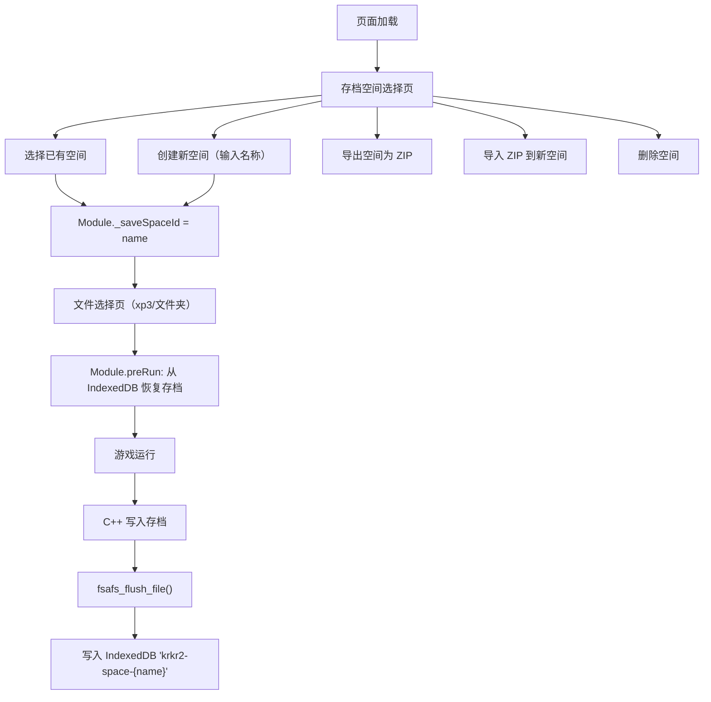

# IndexedDB 存档空间持久化方案

## 现状分析

当前写回机制依赖 File System Access API：

- **Open Game Directory**：`Module._hostDirHandle` 存在，`fsafs_flush_file` 写回宿主目录
- **Select .xp3 File / Upload Folder**：`_hostDirHandle` 为 null，`fsafs_flush_file` 直接 return，存档丢失

## 方案设计

在文件选择页（选择 xp3 / 上传文件夹之前）增加**存档空间管理**步骤。用户手动创建、选择、导出、导入或删除存档空间。每个空间是一个独立的 IndexedDB 数据库。




## 用户交互流程

1. 打开页面 -> 显示**存档空间选择页**（仅对 Select .xp3 / Upload Folder 路径，FSA 路径不受影响）
2. 页面列出所有已存在的空间（名称 + 文件数 + 大小），以及操作按钮
3. 用户可以：
  - **选择**已有空间 -> 进入文件选择页
  - **创建**新空间（输入名称） -> 进入文件选择页
  - **导出**某个空间 -> 下载为 ZIP 文件
  - **导入** ZIP 文件 -> 创建新空间并恢复存档
  - **删除**某个空间
4. 选定空间后，进入正常的文件选择流程（Select .xp3 / Upload Folder / Drag & Drop）
5. 游戏运行中，`fsafs_flush_file` 自动将 `/savedata/` 和 `/save/` 下的写入持久化到对应空间

## 修改范围

只修改 2 个文件，不涉及 C++ 构建系统变更：

### 1. [platforms/web/shell.html](platforms/web/shell.html)

**IndexedDB 封装**（约 40 行）：

- `idbOpen(spaceId)` - 打开数据库 `krkr2-space-{spaceId}`，store 名 `files`
- `idbSaveFile(path, data)` - 写入文件到当前空间
- `idbLoadAll()` - 读取当前空间所有文件
- `idbListSpaces()` - 扫描 `indexedDB.databases()` 列出所有 `krkr2-space-`* 空间
- `idbDeleteSpace(spaceId)` - 删除整个数据库
- `idbGetSpaceInfo(spaceId)` - 获取文件数和总大小

**存档空间选择 UI**（新增 HTML + CSS + JS）：

- 新增 `#save-space-picker` overlay，样式复用现有 `#file-picker` 风格
- 空间列表：每项显示名称、文件数、大小、选择/导出/删除按钮
- 底部：创建新空间（输入框 + 按钮）、导入 ZIP 按钮、跳过（不使用存档空间）
- 导出使用 JSZip（页面已引入）将空间内所有文件打包下载
- 导入读取 ZIP 文件，创建新空间并写入所有文件

**流程修改**：

- 页面加载后，对非 FSA 路径先显示存档空间选择页
- 用户选定空间后设置 `Module._saveSpaceId`，再显示文件选择页
- `Module.preRun` 中：如果 `_saveSpaceId` 已设置，从 IndexedDB 恢复存档到 `/savedata/` 和 `/save/`
- URL 参数 `?xp3=` 路径：检查 localStorage 中缓存的上次使用的空间 ID，有则自动使用

### 2. [cpp/core/environ/web/Platform.cpp](cpp/core/environ/web/Platform.cpp)

修改 `fsafs_flush_file`（第 98-124 行），在 `Module._hostDirHandle` 为 null 时降级到 IndexedDB：

```javascript
EM_JS(void, fsafs_flush_file, (const char *path_ptr), {
    var p = UTF8ToString(path_ptr);
    if (!Module._hostDirHandle) {
        // IndexedDB fallback for save spaces
        if (Module._saveSpaceId && (p.startsWith('/savedata/') || p.startsWith('/save/'))) {
            idbSaveFile(p, FS.readFile(p));
        }
        return;
    }
    // ... existing FSA write-back logic ...
});
```

## 存储策略

- **数据库命名**：`krkr2-space-{userDefinedName}`
- **存储范围**：仅 `/savedata/` 和 `/save/` 下的文件
- **存储时机**：复用 `fsafs_flush_file` 现有调用时机，零额外改动
- **恢复时机**：`Module.preRun` 阶段
- **与 FSA 互斥**：FSA 路径（Open Game Directory）不经过空间选择，不受影响
- **导出格式**：ZIP（使用页面已有的 JSZip），文件路径作为 ZIP 内路径

